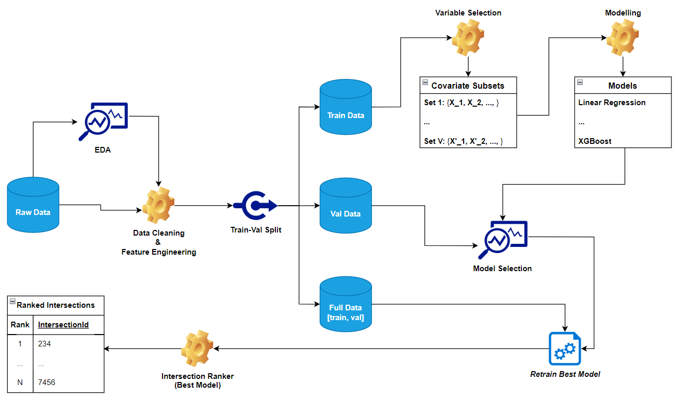
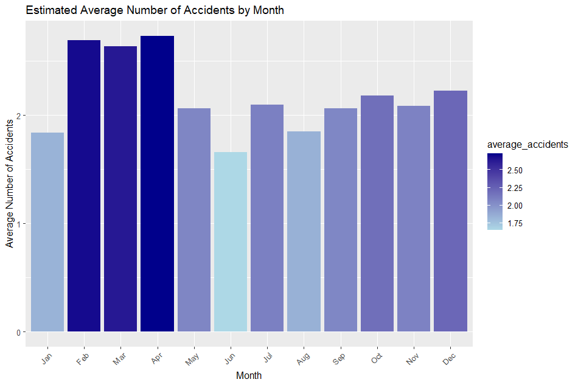
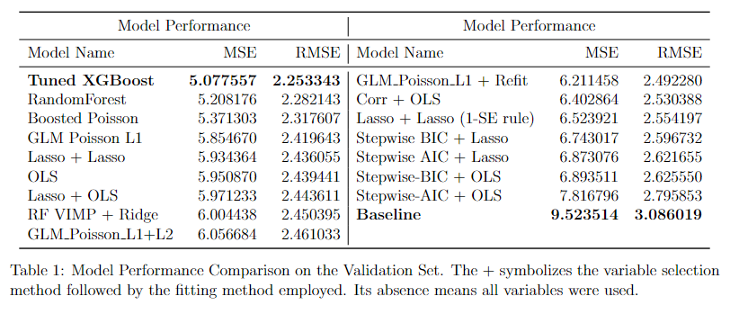

# RoadSafetyPilotProject
Ranking intersections in the City of Montreal as part of a road safety pilot project. 

## Description 

You are a consultant hired by the City of Montreal as part of a road safety pilot project.
Faced with the constant increase in the number of accidents involving pedestrians on its
road network, the city decided to carry out a study to assess the level of risk at road
intersections. To do this, a sample of 1864 signalized intersections was selected (see
figure 1). This sample represents 80% of all signalized intersections on the island of
Montreal. For each intersection, the city has the total number of accidents involving
pedestrians and reported by the police (data from the SAAQ) in the last 10 years. In
addition, Department of Transportation engineers collected the following data:
- Traffic data on the average daily flows of pedestrians and vehicles at each intersection
- Geometry data (design) for each intersection including the number of lanes, types of
signals, layout for left turns, parking restrictions, etc…
- Road safety performance measures calculated by engineers for each intersection, based
on the number of potential daily interactions between pedestrians and vehicles,
depending on the directions and movements of the vehicles.

## Our Take 

Our study aimed to assess the level of risk at road intersections in Montreal by modeling accidents
observed over the last 10 years. Through various statistical learning methods and feature engineering
techniques, we ranked 1864 intersections in terms of safety, providing the city with a prioritized list
for infrastructure improvement. The Extreme Gradient Boosting model performed the best in terms
of mean squared error on the validation set. Retrained on the entire dataset, this model was used to
rank intersections based on predicted safety levels, showing a Spearman correlation of approximately
0.682 with observed accident counts. This indicates the model’s reliability in ranking intersections and
providing insights for urban planners and policymakers to enhance road safety measures.

## How to Run This Project

1. Open RStudio with a directory pointing to the base level of this directory, to ensure all paths
are correctly executed. 
2. Make sure to have `RTools` installed. For Windows, use https://cran.r-project.org/bin/windows/Rtools/
3. Make sure to have installed `XGBoost` correctly as per they [documentation](https://xgboost.readthedocs.io/en/stable/install.html). 
4. Open the `ReplicationCode.Rmd` markdown and execute the script. The function `f_load_packages()` will take care of installation and loading of of all required CRAN packages.

## Project Architecture Workflow

## Data Visualization

### Distribution of Accidents per Borough

### Top 10 Intersections with Most Accidents

### Aggregated Number of Accidents Month by Month

## Results 

